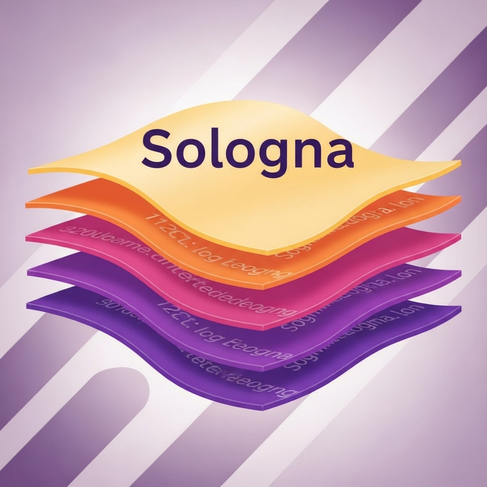

<p align="center">
  
  
</p>

# Sologna

A Rust tool that subscribes to Solana logs via Helius WebSocket RPC, extracts target-program "Program data:" lines safely using a call stack parser, decodes events via an IDL, and streams decoded events to a local sink (stdout, TCP, or OS-native local socket: Windows named pipe / Unix domain socket).

## Features
- Robust WS connection with heartbeat, inactivity timeout, and jittered backoff
- Safe log parsing using a call stack; only accepts Program data emitted by the target program
- IDL-based event decoding with O(1) discriminator lookup
- Decoding offloaded to a bounded worker pool (backpressure-aware)
- Streaming decoded events as NDJSON to stdout/TCP/local socket
- Clean logging defaults (info summaries; debug/trace for detail)
- All non-secret config in `config.toml`; `.env` for secrets only

## Requirements
- Rust (stable)
- A Helius API key (put in `.env`)

## Quick start
1. Copy `.env.example` to `.env` and set your key:
   ```
   HELIUS_API_KEY=your_helius_api_key_here
   ```
2. Edit `config.toml`:
   - Set `target_address` and `idl_file`
   - Adjust `[run]` and `[sink]` as needed (see below)
3. Start the sink reader (auto-selects platform implementation):
   - Default local socket mode:
     ```
     cargo run --bin sink_reader
     ```
   - TCP (optional): use environment overrides:
     ```
     set SINK=tcp
     set SINK_ADDR=127.0.0.1:5555
     cargo run --bin sink_reader
     ```
4. In another shell, run the main app:
   ```
   cargo run --bin sologna
   ```

## Configuration (config.toml)
Top-level:
- `target_address`: Base58 program address to monitor
- `idl_file`: Path to the IDL JSON used for event decoding
- `commitment`: `processed` | `confirmed` | `finalized`

`[run]`:
- `log_level`: `trace` | `debug` | `info` | `warn` | `error`
- `heartbeat_interval_ms`: WS ping interval (0 disables)
- `read_timeout_ms`: Reconnect when no messages arrive within this window (0 disables)
- `backoff_base_ms`, `backoff_max_ms`, `backoff_jitter`: reconnect backoff controls
- `decode_queue_capacity`: queue size for decode tasks
- `decode_concurrency`: number of parallel decode workers

`[sink]`:
- `type`: `stdout` | `tcp` | `local` | `none`
- `addr`:
  - Windows named pipe: `\\\\.\\pipe\\sologna` (TOML string needs escaping)
  - Unix socket: `/tmp/sologna.sock`
  - TCP: e.g. `127.0.0.1:5555`
- `queue_capacity`: buffering for sink messages
- `write_timeout_ms`: per-write timeout to sink

## Event stream format (NDJSON)
One JSON per line with these fields when a decode succeeds:
```json
{"signature":"...","commitment":"processed","program":"<program>","event_name":"...","event_data":{...}}
```
If an event cannot be decoded, warnings are logged; no NDJSON is emitted for that line.

## Logging
- Info: startup, subscription confirmed, concise decoded-event summaries, periodic stats, reconnects
- Debug: accepted/indirect matches, detailed decoded payloads
- Trace: full raw JSON and raw log lines

Set the level at `run.log_level` in `config.toml`.

## Troubleshooting
- Windows named pipe: start `sink_reader` first, then the main app. Ensure both use the same `sink.addr`.
- No decoded events: confirm `idl_file` points to the correct IDL and the target program actually emits events.
- Backpressure drops: increase `decode_queue_capacity`/`decode_concurrency` or `sink.queue_capacity`.
- If a local socket already exists on Unix, the Unix reader removes it before binding. If bind fails, delete `/tmp/sologna.sock` and retry.

## Development
- Format and lint:
  ```
  cargo fmt --all
  cargo clippy --all-targets
  ```
- Tests (recommended future additions):
  - Unit tests for call-stack parser
  - Golden tests for decoder

## License
MIT. See [LICENSE](LICENSE).
